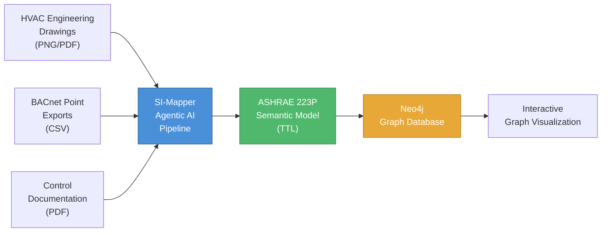
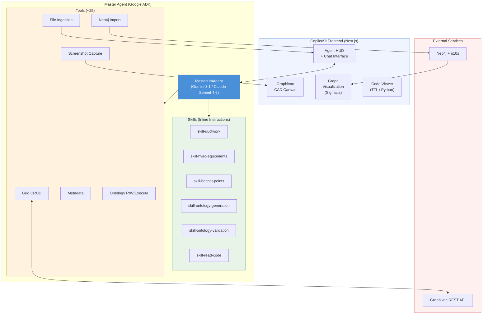

<objective>
Create the complete LaTeX document skeleton and render all Mermaid diagrams to PNG.

Purpose: Establishes the document structure that all subsequent plans write content into. Without this foundation, no section content can be compiled or verified.
Output: Compilable LaTeX document with 6 section stubs, 3 rendered PNG diagrams, and correct preamble.
</objective>

<execution_context>
@/home/juan/codes/si-mapper/.claude/get-shit-done/workflows/execute-plan.md
@/home/juan/codes/si-mapper/.claude/get-shit-done/templates/summary.md
</execution_context>

<context>
@.planning/phases/14-write-comprehensive-research-report-on-si-mapper-development/14-CONTEXT.md
@.planning/phases/14-write-comprehensive-research-report-on-si-mapper-development/14-RESEARCH.md
@.planning/phases/14-write-comprehensive-research-report-on-si-mapper-development/14-VALIDATION.md
</context>

<tasks>

<task type="auto">
  <name>Task 1: Create LaTeX skeleton with main.tex, 6 section stubs, and directory structure</name>
  <files>report/main.tex, report/sections/01-introduction.tex, report/sections/02-problem.tex, report/sections/03-solution.tex, report/sections/04-implementation.tex, report/sections/05-results.tex, report/sections/06-conclusions.tex</files>
  <read_first>report/report.md</read_first>
  <action>
1. Create directories: `report/sections/`, `report/figures/`, `report/diagrams/`

2. Create `report/main.tex` with this exact structure:

```latex
\documentclass[11pt, a4paper]{article}

% Typography and layout
\usepackage[margin=2.5cm]{geometry}
\usepackage{microtype}
\usepackage[T1]{fontenc}
\usepackage[utf8]{inputenc}
\usepackage{lmodern}

% Tables
\usepackage{booktabs}
\usepackage{tabularx}
\usepackage{longtable}

% Figures
\usepackage{graphicx}
\graphicspath{{figures/}}

% Colors and links
\usepackage[dvipsnames]{xcolor}
\usepackage[colorlinks=true, linkcolor=NavyBlue, citecolor=ForestGreen, urlcolor=NavyBlue]{hyperref}

% Lists
\usepackage{enumitem}

% Captions
\usepackage[font=small, labelfont=bf]{caption}

% Section styling
\usepackage{titlesec}
\titleformat{\section}{\Large\bfseries}{\thesection}{1em}{}
\titleformat{\subsection}{\large\bfseries}{\thesubsection}{1em}{}

% Custom TODO command (visible red markers for placeholder data)
\newcommand{\todo}[1]{\textcolor{red}{\textbf{[TODO: #1]}}}

\title{SI-Mapper: Agentic AI for Automated HVAC Semantic Modeling\\[0.5em]
\large From BACnet Data and Engineering Drawings to ASHRAE 223P Ontologies}
\author{Juan [Last Name] \\ \textit{[Affiliation]}}
\date{March 2026}

\begin{document}

\maketitle

\begin{abstract}
This report presents SI-Mapper, an agentic AI system that automates the creation of ASHRAE 223P semantic building models from HVAC engineering drawings and BACnet point data. We describe the problem of manual BACnet point mapping --- a costly, labor-intensive process that blocks building software interoperability and grid integration --- and present an AI-driven solution that replaces weeks of expert engineering work. The report traces the development through nine experimental iterations, from simple function-calling approaches to the final skills-based single master agent architecture, and provides a framework for comparing AI-generated results against human engineer baselines.
\end{abstract}

\tableofcontents
\newpage

\input{sections/01-introduction}
\input{sections/02-problem}
\input{sections/03-solution}
\input{sections/04-implementation}
\input{sections/05-results}
\input{sections/06-conclusions}

\end{document}
```

3. Create each section stub file with a section heading and a one-line placeholder comment:

- `report/sections/01-introduction.tex`:
```latex
\section{Introduction and Context}
\label{sec:introduction}

% Content to be written in Plan 02
```

- `report/sections/02-problem.tex`:
```latex
\section{Description of the Problem}
\label{sec:problem}

% Content to be written in Plan 02
```

- `report/sections/03-solution.tex`:
```latex
\section{A Solution: Agentic AI for Building Semantic Modeling}
\label{sec:solution}

% Content to be written in Plan 02
```

- `report/sections/04-implementation.tex`:
```latex
\section{Implementation}
\label{sec:implementation}

% Content to be written in Plan 03
```

- `report/sections/05-results.tex`:
```latex
\section{Results}
\label{sec:results}

% Placeholder content to be written in Plan 03
```

- `report/sections/06-conclusions.tex`:
```latex
\section{Conclusions}
\label{sec:conclusions}

% Content to be written in Plan 04
```

4. Verify compilation: Install pdflatex if needed (`sudo apt-get install -y texlive-latex-recommended texlive-fonts-recommended texlive-latex-extra`), then run `cd report && pdflatex -interaction=nonstopmode main.tex`. Confirm exit code 0 and no lines starting with `!`.
  </action>
  <verify>
    <automated>cd /home/juan/codes/si-mapper/report && pdflatex -interaction=nonstopmode main.tex 2>&1 | grep -c "^!" | xargs test 0 -eq</automated>
  </verify>
  <acceptance_criteria>
    - report/main.tex contains \input{sections/01-introduction}
    - report/main.tex contains \input{sections/06-conclusions}
    - report/main.tex contains \newcommand{\todo}
    - report/main.tex contains booktabs
    - report/sections/01-introduction.tex contains \section{Introduction and Context}
    - report/sections/02-problem.tex contains \section{Description of the Problem}
    - report/sections/03-solution.tex contains \section{A Solution
    - report/sections/04-implementation.tex contains \section{Implementation}
    - report/sections/05-results.tex contains \section{Results}
    - report/sections/06-conclusions.tex contains \section{Conclusions}
    - ls report/sections/0{1..6}-*.tex returns 6 files
    - pdflatex -interaction=nonstopmode report/main.tex exits 0
  </acceptance_criteria>
  <done>LaTeX skeleton compiles cleanly to PDF. All 6 section stub files exist with correct headings. Directory structure (sections/, figures/, diagrams/) created.</done>
</task>

<task type="auto">
  <name>Task 2: Create and render 3 Mermaid diagrams to PNG</name>
  <files>report/diagrams/pipeline.mmd, report/diagrams/architecture.mmd, report/diagrams/experiment-progression.mmd, report/figures/pipeline.png, report/figures/architecture.png, report/figures/experiment-progression.png</files>
  <read_first>agent/skills.md, agent/tools.md, report/report.md</read_first>
  <action>
1. Install Mermaid CLI if not available: `npm install -g @mermaid-js/mermaid-cli`

2. Create `report/diagrams/pipeline.mmd` — the high-level data pipeline (for Section 3):



3. Create `report/diagrams/architecture.mmd` — the final system architecture (for Section 4):



4. Create `report/diagrams/experiment-progression.mmd` — the 9-iteration timeline (for Section 4):

```mermaid
flowchart LR
    V1["V1\nFunction\nCalling\n(Gemini 1.5)"] --> V2["V2\nWorkflows\n(LangChain)"]
    V2 --> V3["V3\nADK\nWorkflows\n(Gemini 2.0)"]
    V3 --> V4["V4\nMaster Agent\nAgentic\n(Gemini 2.5)"]
    V4 --> V5["V5\nPAR\nArchitecture"]
    V5 --> V6["V6\nMaster +\nPAR Sub-agent"]
    V6 --> V7["V7\nMaster +\nHybrid\nWorkflows"]
    V7 --> V8["V8\nParallel\nAgents\n(Gemini 3.0)"]
    V8 --> V9["V9\nSkills-Based\nMaster Agent\n(Gemini 3.1)"]

    style V1 fill:#FFE0E0,stroke:#CC5555
    style V2 fill:#FFE0E0,stroke:#CC5555
    style V3 fill:#FFE8CC,stroke:#CC8833
    style V4 fill:#FFE8CC,stroke:#CC8833
    style V5 fill:#FFFACC,stroke:#CCAA33
    style V6 fill:#FFFACC,stroke:#CCAA33
    style V7 fill:#E0F0E0,stroke:#55AA55
    style V8 fill:#E0F0E0,stroke:#55AA55
    style V9 fill:#4A90D9,color:#fff,stroke:#2C5F8A
```



5. Render all three diagrams to PNG:
```bash
cd /home/juan/codes/si-mapper/report
mmdc -i diagrams/pipeline.mmd -o figures/pipeline.png -w 1200 -H 400 --backgroundColor transparent
mmdc -i diagrams/architecture.mmd -o figures/architecture.png -w 1200 -H 800 --backgroundColor transparent
mmdc -i diagrams/experiment-progression.mmd -o figures/experiment-progression.png -w 1600 -H 300 --backgroundColor transparent
```

If `mmdc` fails with puppeteer/chromium issues, try: `npx @mermaid-js/mermaid-cli -i diagrams/pipeline.mmd -o figures/pipeline.png` etc. If that also fails, use `npx mmdc` with `--puppeteerConfigFile` pointing to a config with `{ "args": ["--no-sandbox"] }`.

6. Verify all 3 PNG files exist and have non-zero size.
  </action>
  <verify>
    <automated>test -s /home/juan/codes/si-mapper/report/figures/pipeline.png && test -s /home/juan/codes/si-mapper/report/figures/architecture.png && test -s /home/juan/codes/si-mapper/report/figures/experiment-progression.png && echo "All 3 diagrams exist"</automated>
  </verify>
  <acceptance_criteria>
    - report/figures/pipeline.png exists and has size > 0
    - report/figures/architecture.png exists and has size > 0
    - report/figures/experiment-progression.png exists and has size > 0
    - report/diagrams/pipeline.mmd exists
    - report/diagrams/architecture.mmd exists
    - report/diagrams/experiment-progression.mmd exists
    - mmdc --version exits 0
  </acceptance_criteria>
  <done>Three Mermaid diagrams (pipeline, architecture, experiment-progression) exist as .mmd source files and are rendered as PNG in report/figures/. All PNGs have non-zero file size.</done>
</task>

</tasks>

<verification>
- `pdflatex -interaction=nonstopmode report/main.tex` exits 0 with no `!` error lines
- `ls report/sections/0{1..6}-*.tex | wc -l` returns 6
- `ls report/figures/*.png | wc -l` returns at least 3
- `ls report/diagrams/*.mmd | wc -l` returns 3
</verification>

<success_criteria>
- LaTeX document compiles without errors
- All 6 section stub files exist with correct \section headings
- 3 Mermaid diagrams rendered as PNG in figures/
- Directory structure: report/{main.tex, sections/, figures/, diagrams/}
</success_criteria>

<output>
After completion, create `.planning/phases/14-write-comprehensive-research-report-on-si-mapper-development/14-01-SUMMARY.md`
</output>
