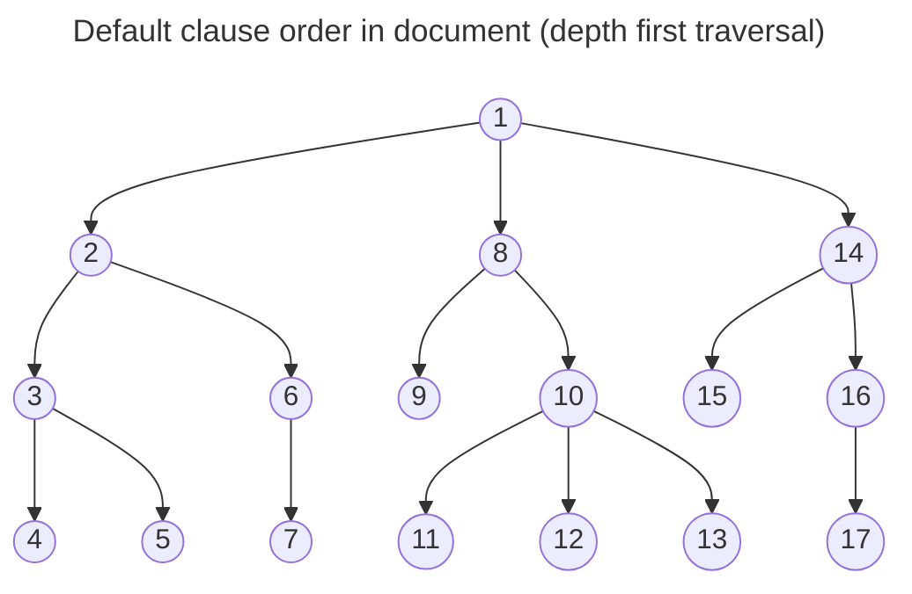
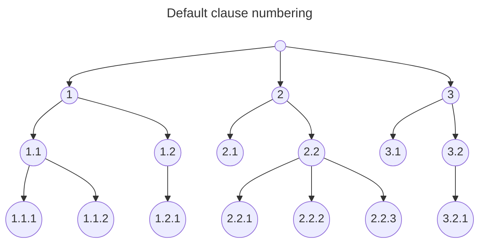
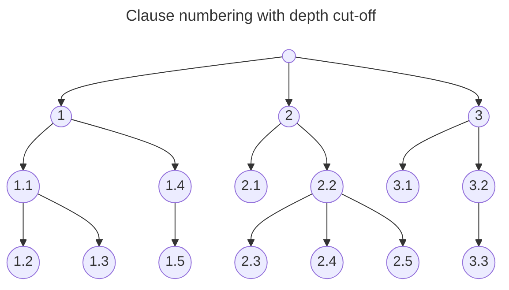

# Publication Build

[**Link to latest artifacts**](https://bas-im.emcs.cornell.edu/223/223standard/-/jobs/artifacts/master/download?job=document)

This directory contains the scripts and templates for building the Microsoft
Word documentation file from the 223 model and related files.  There is a
progressive sequence of steps in this process, and later steps can be repeated
without having to start at the beginning.

There is a `requirements.txt` which contains the packages required for correct
operation.

## Usage

Run `bash build-documentation.sh` from this directory. The script currently
searches for all `.ttl` files in the `publication/`, `models/` and `data/`
directories, but this can be modified.

The documentation will be rebuilt on every push/merge request. Look at the
[pipelines](https://bas-im.emcs.cornell.edu/223/223standard/pipelines) page for links to the built artifacts corresponding to your job.

## Implementation

### 1 Word Template

There is a **template.docx** file that is constructed using Word that contains
samples of each type of content such as headings, character and list styles.
Edit this file to adjust the output of the resulting publication document.
There can be multiple versions of this template (with different file names) to
test various combinations of styles.

### 2 Word Unzipped

The template document is a ZIP file of a number of other components that are
closely linked XML files which need to be unziped:

```
$ unzip template.docx -d template/
```

### 3 Style Analysis

There is a **md2word_extract.py** application that takes the **document.xml**
inside the directory created above and extracts style information from it,
creating a **md2word_styles.py** file with the results:

```
$ python md2word\_extract.py template/word/document.xml md2word\_styles.py
```

### 4 TTL to Markdown

There is a **ttl2md.py** application that takes a list of Turtle files as
inputs, merges them together into a graph, optionally runs the RDFS and/or
OWLRL semantic inferencing rules, and outputs a Markdown file.

```
$ python ttl2md.py demo1.ttl demo2.ttl demo.md
```

There is an additional option to save the intermediate expanded graph for
debugging.

<details>
<summary>Rendering with Cutoff</summary>

`ttl2md-cutoff.py` contains an implementation of `ttl2md.py` that limits the
depth-first traversal of the graph to a specified cutoff value.








Run with a cutoff of 5 like this:

```
# where $ttl_files is computed like in build-documentation.sh
python3 ttl2md-cutoff.py --cutoff 5 223p_publication.md $ttl_files
```

</details>

### 5 Clone the Template Directory

Make a clone of the template directory created in step 2:

```
$ cp -R template/ demo/
```

### 6 Markdown to Word

There is a **md2word.py** application that takes the Markdown generated from
step 4 and _implicitly_ the md2word_styles.py file created in step 3 and
re-writes the **document.xml** file created in step 5.

```
$ python md2word.py demo.md demo/word/document.xml
```

### 7 Zip a Word Document

The final step is to remove the old DOCX file if it exists and create a
new file from the cloned/update directory:

```
$ rm -f demo.docx && pushd demo/ && zip -r ../demo.docx . && popd
```

And the cloned template directory can be deleted:

```
$ rm -Rf demo/
```
